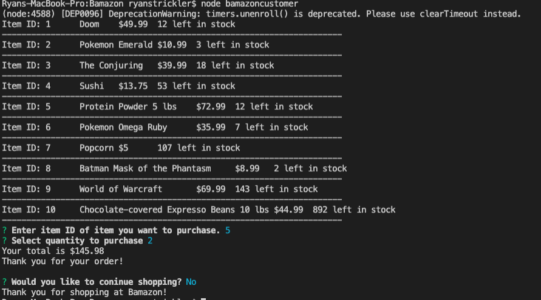
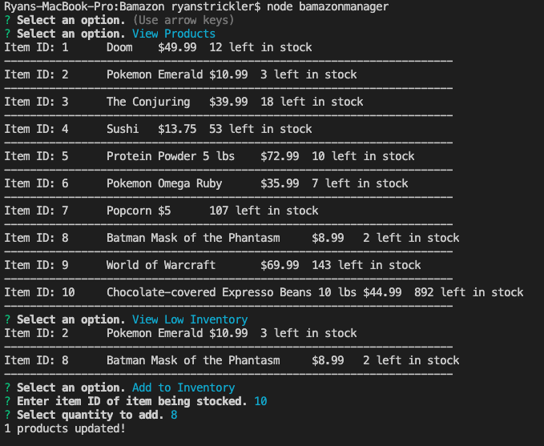
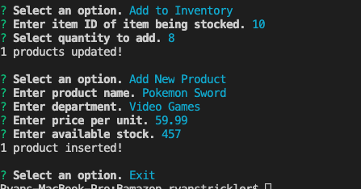
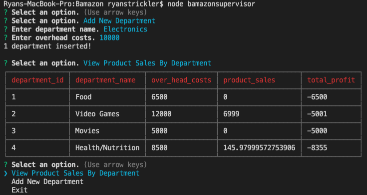

# Bamazon

## Description
A command line nodeJS app with three modes (Customer, Manager, and Supervisor). Each mode allows the user to execute different operations.

#### bamazonCutomer.js
This file allows the user to assume the role of a customer. The user can:
* select an item to purchase
* specify the quantity to purchase

A total is displayed to the user and the database is updated.



#### bamazonManager.js
This file allows the user to assume the role of a manager. The user can:
* view all products in the store
* view all products with a stock less than 5
* add stock to a specified item in the store
* add a new item to the store




#### bamazonSupervisor.js
This file allows the user to assume the role of a supervisor. The user can:
* create a new department
* view products sales within each department



### Technologies Used
* nodeJS
* mySql 
* Inquirer

## Installation
Dependencies can be installed by navigating to the root folder and running:
`npm install`

## Usage
A local mySQL database is needed to run this application. [MAMP](https://www.mamp.info/en/downloads/) can be used to run a local mySQL server. You will also need [MySQL Workbench](https://dev.mysql.com/downloads/workbench/) or [Sequel Pro](https://sequelpro.com/download).

Depending on your settings, you may need to change the connection object to match your port, username and password.
```javascript
var connection = mysql.createConnection({
    host: "127.0.0.1",
    port: 8889,
    user: "root",
    password: "root",
    database: "bamazon"
});
```
You will also need to run the [bamazon.sql](./bamazon.sql) file to seed your database.

To run the app, open the Bamazon folder in the terminal and run:
`node fileName` where filename is one of the three .js files

## Upcoming Features
There are no upcoming features planned at this time.

## Authors and Acknowledgements
* Ryan Strickler
