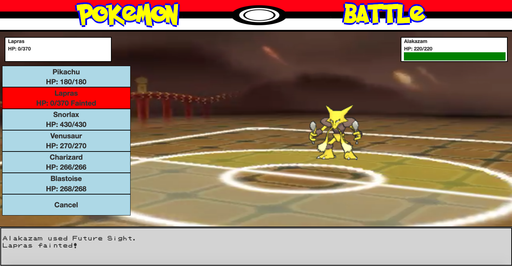

# Pokemon-Game

## Description
A fun RPG-style Pokemon battle simulator. Pick a trainer (Red or Blue) and defeat your opponent! The objective is to knock out all six of your opponent's Pokemon before they knock out yours. Mechanics from the real Pokemon games (type match-ups, stats, damage calculation) are incorporated into the app. 

### Technologies Used
- HTML5 
- Bootstrap 
- jQuery

## Installation and Usage

To run this app locally, you will need to install [http-server](https://www.npmjs.com/package/http-server). To install globally run `npm install http-server -g`. While in the root directory, run `http-server` then navigate to http://localhost:8080. You can change the port using the -p flag when running http-server.

To begin you must first select a character to play as. Then you will need to select your first Pokemon to send out. The player can then use one of four attacks or withdraw their Pokemon to switch out for another. Doing this will cost the player their turn. The objective is to reduce your opponent's Pokemon's HP to 0 to make them faint. The user wins if all of the opponents Pokemon faint, but if all of the player's Pokemon faint, they lose.

## Issues

- opponent's Pokemon chose moves randomly
- status moves have no effect
- status conditions have no effect

## Upcoming Features

- create classes for Pokemon and Attacks
- adding unique AI functions to each Pokemon for choosing an attack
- allow opponent to switch out their Pokemon
- add move effects
- add logic for status conditions
- add abilities for Pokemon

## Authors and Acknowledgements

- Ryan Strickler